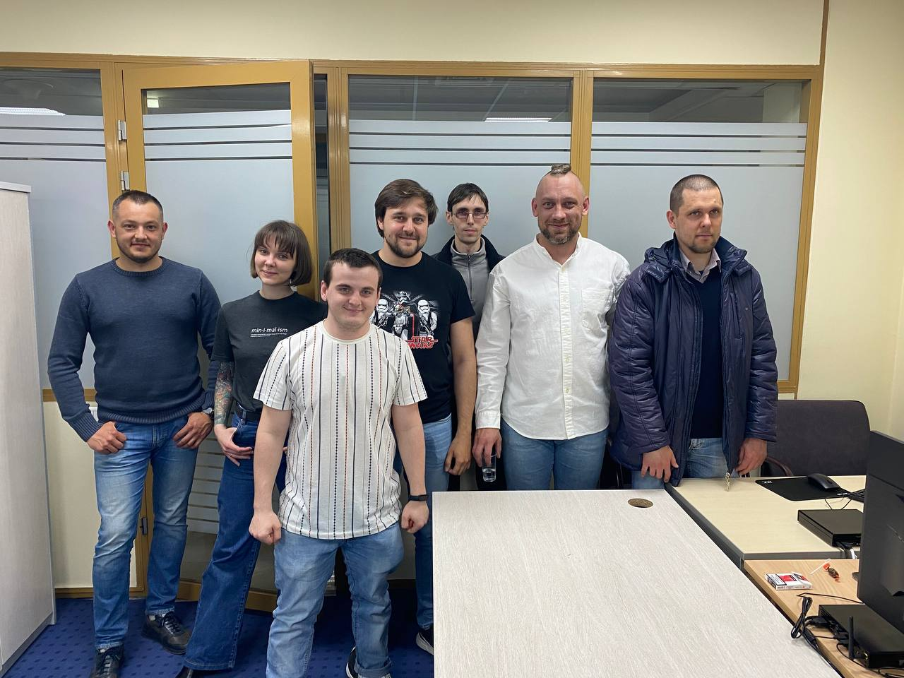

# Вести с полей

В понедельник 26 апреля, через три недели после планируемой даты запуска, мы таки запустили ШКАР.

Что мы узнали за первые 9 дней обучения:

## Административное

### Запуск школы

Подбирал ребят я 3 недели.

Чтобы уменьшить срок набора на месте, нужно проводить подготовительную работу.

В следующий раз я за 2-3 месяца приеду в выбранный город, проведу митап для заинтересованных, расскажу про школу. Позову помочь кого-то из отучившихся товарищей.

Заинтересовавшимся выдам наш квалификационный опросник и, при нужде, учебники.

Также нужно будет заранее запланировать же квалификационные интервью (несколько дней) и старт школы и озвучить заинтересованным.

Через 2-3 месяца, когда придёт время начинать, приехать за неделю, провести эти самые квалификационные интервью.

Таким образом мы получим более высокий уровень на старте и сократим срок подбора втрое (до недели).

Ребята отбираемые ещё не будут знакомы друг с другом, что не даст возможности появления соревновательных (негативных) социальных динамик.

Те, кто не смогли пройти отбор почему-то, получат всё равно подробную обратную связь и смогут претендовать на следующий запуск.

### Начало дня

Выбор часов обучения должен быть опосредован факторами внешней среды и удобства ребят (по сути, взаимосвязанные вещи).

Мы решили начинать в 8: солнце встаёт в краснодаре рано, пробки позже жуткие.

Если подстроиться под режим более близкий к натуральным циркадным ритмам, кажется, получается и правда лучше учиться.

Также кажется важным, что заканчивать в 17 — значит, иметь много времени вечером на то, чтобы знания «усвоились». Для успешного усвоения _необходимо_, чтобы у учащихся было достаточно времени на смену деятельности и отдых.

Возможно, в Санкт-Петербурге придётся выбирать другие часы. Возможно, зимой придётся делать иначе. Пока непонятно.

### Причиндалы

Всё стоит заранее заказать, а ещё и допустить пару-тройку дней «сверху» сроков доставки.

Нужные вещи:
- доска маркерная
- маркеры, губка
- магниты для доски
- салфетки для мониторов
- мусорки
- кофе/чай
- листы бумаги А4
- ручки

Лучше доску брать размером хотя бы 150х70.

Нужно также прояснять заранее, как доску крепить.

### Маленькие компьютеры с убунтой — хорошо

DELL Optiplex 3080 — отличные компы для обучения: тихие, маленькие, достаточно мощные. То, что они занимают мало места на столе, в нашей конфигурации парт очень оказалось на пользу.

Ubunta для обучения вполне хороша, пока что не было ничего проблемного с ней.

Каждому обучающемуся стоит завести свой пользовательский аккаунт в Убунте — так удобнее настраивать среду разработки и git под себя.

Если обучающийся желает принести и пользоваться своим привычным устройством — даже лучше, по сути, все компьютеры наши — лишь терминалы для ввода текста, мы предоставляем нрмальные терминалы с возможностью полноценной настройки, но каждый волен принести и свой.

## Педагогическое

### Разнообразие в команде — прекрасно и необходимо

Уровни знаний ребят разные. Товарищи, объясняющие друг другу что-то под моим присмотром, гораздо лучше и сами понимать начинают. Также положительные социальные динамики наблюдать приятно — мы «срабатываемся».

То же можно сказать и про возраст — разница в возрасте между двумя ребятами — 15 лет. И всё замечательно.

Кажется, что разнообразие вкупе с общим фокусом внимания на коллективном труде натурально помогает ребятам учиться взаимодействовать друг с другом, готовя их к командной работе после трудоустройства.

Более того, такое разнообразие побуждает рефлексировать при объяснении и общении, помогает лучше научиться коммуницировать, приучает к тому, что люди разные.

Считаю, что необходимо избегать подбора «похожих» людей, разнообразие необходимо и полезно.

## Физиология труда

Необходимо убедиться, что в комнате, предназначенной для обучения, достаточно солнечного света, но не слишком много (регулируется жалюзи или чем-то таким).

Также лучше всего, когда в комнате будет или мало людей не из группы, или вообще не будет. Кажется, что наличие в комнате людей с первого дня провоцирует стеснение, которое преодолевать гораздо легче, когда команда уже сработалась (где-то со второй недели), так как возникает взаимная поддержка и «чувство локтя».

Просто необходимо, чтобы комната хорошо проветривалась, желательнее всего забортным чистым прохладным воздухом. Также нельзя допускать переохлаждения.

- малое количество отвлечений
- перерывы: сначала предлагаю я, потом запрашивают обучающиеся
- с самого начала, пока ребята ещё не свыклись с правилами и распорядком, особо важно побуждать останавливаться вовремя (похожее есть и в спорте). Особо важно это потому, что усвоение материала и переработка его происходит позже вечером, и лучше, когда ребята уже не сидят за компьютером, но занимаются чем-то другим

### Инициатива, рефлексия, анализ

Каждую инициативу нужно поощрять, полезные необходимо принимать, неполезные — ни в коем случае не отбрасывать «просто потому что я так сказал», нужно всеми силами избегать догматизма и провоцировать обсуждение, анализ и рационализацию инициатив.

Стоит вообще с самого начала стараться «обнажать инструментарий» как можно больше — объяснять, почему мы выбираем то или иное.

Пример — есть два видеоролика по одной теме. Стоит предложить просмотреть оба и выбрать, какой из них «лучше заходит», и обсудить почему так.

Нужно с самого начала побуждать в ребятах желание максимизировать эффективность обучения, что невозможно без критического отношения к получаемой информации и форме, в которой она подаётся.

Необходимо каждый день пытаться рефлексировать и анализировать всей командой, разбираясь, насколько хорошо мы продвинулись вперёд и выбирая, что можно убрать/поменять.

Пример: почитали теорию HTTP, поняли, что не идёт, сели за практику, разобрались.

Дальше попытались таким же подходом «взять» DB, не получилось, решили вначале всё же ознакомиться с теорией, потом уже закрепляя теорию практикой.

Выбирать структуру и форму подачи и усваивания материала необходимо под каждый модуль.

Чтобы все эти полезные рефлективно-анализирующие механизмы работали, нужно, чтобы был достаточный уровень психологического комфорта.

### Психологический комфорт

Особенно важным фактором, влияющим на психологически комфортную атмофсеру, я считаю изначальную установку, что критерием успешности проекта ШКАР является найм всей группы.

Такая установка создаёт психологически комфортную среду, побуждающую товарищей обучающихся помогать друг другу натурально, и не провоцирует соревновательность.

Более того, когда отпал Георгий, товарищи волновались, всё ли будет хорошо с группой. Это показывает, что с достаточно высокой вероятностью они были бы побуждены помочь отстающему, если такой был бы.

Также важно показать, что процесс обучения, как и процесс работы, растянут во времени — нет необходимости «закончить всё сегодня», некоторые вещи вполне можно переносить на следующий день. Соблюдая, однако, принцип рациональности — если для завершения задачи нужно посидеть еще 20-25 минут, эффективнее её закончить. Также, впрочем, как нет смысла начинать большую новую задачу за 20-25 минут до конца рабочего дня.

Понятно, что в группе не должно быть конфликтов: перехода на личности нельзя допускать, но если конфликты происходят, нужно проанализировать, где в процессе отбора была допущена ошибка, и адаптировать процесс отбора соответственно.

### Знания

Помимо непосредственно предметной области, нельзя забывать о:
- понятия рациональности — код вообще не нужен, а нужен тогда, когда точно нужен. Решение должно быть минимальным, но соответствовать критериям качества.
- понятия экономики предприятия — мы работаем для максимизации прибыли минимальными усилиями. Это не значит, что усилия не надо применять, как раз наоборот — надо применять такие умственные усилия, чтобы минимальным трудом получать максимальную прибыль.
- код пишется для людей
- понятие коммуникации в команде, потеря информации при прохождении.

- постоянное побуждение к рефлексии: понимаем ли материал, _как_ понимаем его, _как_ идёт процесс усваивания - это побуждение формирует более _мощный_ приём сигнала

- с самого начала показывать, что мнение учащихся важно и нужно — мы выбираем от времени старта до того, есть ли смысл смотреть видео
- учить процессу
- учить рациональности в труде
- чтобы больше говорили учащиеся, чем учитель
- хвалить!
- спрашивать как там что — пусть довольно расскажут, похвалятся тем, что осознали
- до часа на «разминку»/»врабатывание» — когда ребята пришли, неэффективно неразмятыми мозгами брать новое. Лучше поковырять вчерашнее, что даст и вход в контекст, и поможет закрепить вчерашнее, и подготовит мозги к сегодняшнему
- радовать ребят!
- микропаузы (до 5 минут) — чай / поболтать / кикер

- пара местных ребят продолжают со мной общаться, вроде как заинтересованы попробовать снова

- помощник — Валя? Провести её через следующую школу, показать, как что?
